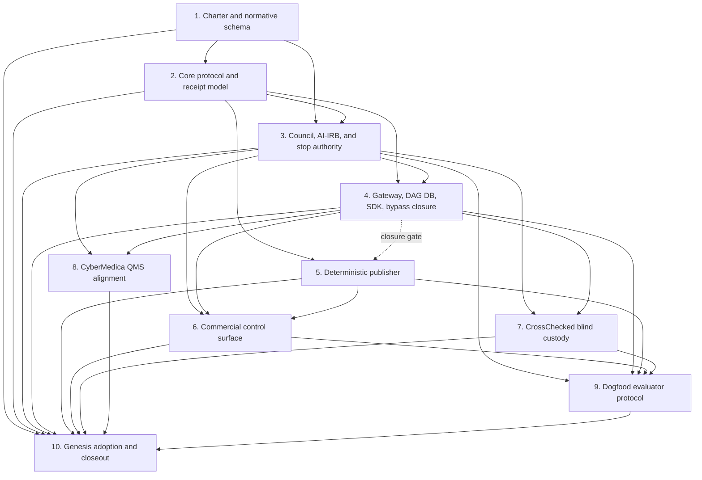

<!--
Copyright 2026 Exochain Foundation

Licensed under the Apache License, Version 2.0 (the "License");
you may not use this file except in compliance with the License.
You may obtain a copy of the License at:

    https://www.apache.org/licenses/LICENSE-2.0

Unless required by applicable law or agreed to in writing, software
distributed under the License is distributed on an "AS IS" BASIS,
WITHOUT WARRANTIES OR CONDITIONS OF ANY KIND, either express or implied.
See the License for the specific language governing permissions and
limitations under the License.

SPDX-License-Identifier: Apache-2.0
-->

# DF-PROTOCOL-001 Delivery Map

**Design authority:**
`docs/superpowers/specs/2026-07-16-decision-forum-peer-reviewed-protocol-governance-design.md`
at design head `23742d90ad4f08f62a668ca7b371b9e318177885`.

**Authority boundary:** This delivery map and its implementation plans are
engineering records. They do not ratify D9 Amendment 1, issue credentials,
activate binding Council or AI-IRB authority, deploy a runtime, publish a
package, or authorize action. Binding mode remains fail-closed until the exact
content-addressed amendment is authenticated and constitutionally ratified.

## Slice dependency graph

Slice 5 may begin after the package types in slice 2 stabilize, but it cannot
close until slice 4 supplies authoritative publication receipts and
reconstruction. Slices 6, 7, and 8 are independently reviewable after their
core contracts exist. Slice 9 does not depend on CyberMedica product changes,
but slice 10 closes the full program only after all ten slices have independent
approval evidence.

## Verified repository gaps that constrain the plans

The branch-head scan found reusable primitives and concrete conflicts. These
are repository observations, not implementation or runtime claims:

- `crates/decision-forum/src/constitution.rs` already verifies signed
  ratification/amendment operations, but no D9 Amendment 1 artifact or
  runtime-visible proof binds the exact amendment bytes to protocol binding
  mode.
- `crates/decision-forum/src/decision_object.rs` commits only vote, evidence,
  and receipt counts in `content_hash`; changing an existing authoritative item
  can leave that hash unchanged. Slice 2 must commit full leaves rather than
  extend the count-only hash.
- `crates/decision-forum/src/workflow.rs` defines an eleven-stage parallel
  workflow that omits `Denied`, `Escalated`, and `Remediated`; protocol
  milestones must layer on the canonical fourteen-state BCTS implementation in
  `exo-core` instead of creating another lifecycle.
- `crates/exo-governance/src/crosscheck.rs` can count actors with no registry
  facts as independent, and `conflict.rs` removes recusals from the denominator.
  Slice 3 needs a package-bound, fail-closed seat qualification path and must
  not reuse denominator-shrinking conflict logic for protocol authorization.
- `crates/exo-gateway/src/server.rs` mounts only create and single-decision
  read; the list query and hardened vote handler exist elsewhere but are
  unmounted. Create stores a summary JSON projection while the vote handler
  expects a full `DecisionObject`, so mounting it unchanged would not work.
- Feature-enabled GraphQL is a separate in-memory authority surface with
  caller-provided tenant/status behavior. The SDK also contains a separate
  in-memory governance prototype. Slice 4 must route every ingress through one
  canonical service or preserve explicit refusal.
- Current Decision Forum projection tables lack the required RLS/immutable
  protocol history, and the DAG DB receipt/idempotency/outbox APIs do not yet
  accept one gateway-owned transaction. Receipt reconstruction does not fully
  validate contiguous sequence, recomputed hashes, or stale heads.
- No `PeerReviewedProtocolPackageV1` publisher, authoritative CBOR exporter,
  Markdown/HTML/PDF-A renderer, manifest verifier, or publication CLI exists.
- `tools/cross-impl-test/compare.sh` currently compares manufactured vector
  pass counts after running an external TypeScript repository's generic test
  suite; that repository does not execute the committed EXOCHAIN vectors.
  Slice 1 therefore hardens the canonical in-repository harness to execute the
  same vectors in Rust and pinned TypeScript and compare actual normalized
  outputs in temporary directories before any later slice may cite the gate.
- `web/` still carries Apache headers and a handwritten contract with obsolete
  states/routes, caller-supplied actor fields, `Date.now`/`Math.random`
  identifiers, and local DAG DB authority assumptions. The proprietary license
  boundary must be established before product edits.
- The existing CrossChecked node feature is a legacy receipt anchor using
  wall-clock time, not a blind-assignment/commitment/reveal contract. The
  proprietary CrossChecked runtime remains outside this repository.
- CyberMedica has strong proprietary QMS/CAPA/document controls, but its policy
  modules currently encode blanket human-finality. Slice 8 must add only an
  exact ratified-envelope exception while preserving human-only defaults and
  stricter clinical/customer policies.
- No dogfood claim registry, fixed deterministic audit sample, evaluator
  qualification package, `DF-ROADMAP-001` record, or
  `GenesisAdoptionReceipt` exists. README DAG DB compression language still
  requires historical-evidence qualification before evaluator-first
  publication.

## Plan and branch boundaries

| Slice | Plan artifact | Branch / PR boundary | Path class |
|---|---|---|---|
| 1 | `2026-07-16-df-protocol-001-01-charter-normative-schema.md` | `bob-stewart/df-protocol-001-01-charter-schema` | EXOCHAIN core governance/documentation plus isolated core CI/test-tool hardening |
| 2 | `2026-07-16-df-protocol-001-02-core-protocol-receipt-model.md` | `bob-stewart/df-protocol-001-02-core-model` | EXOCHAIN core |
| 3 | `2026-07-16-df-protocol-001-03-council-ai-irb-stop-authority.md` | `bob-stewart/df-protocol-001-03-authority` | EXOCHAIN core |
| 4 | `2026-07-16-df-protocol-001-04-gateway-dagdb-sdk-bypass-closure.md` | `bob-stewart/df-protocol-001-04-runtime-adapter` | Core runtime adapter |
| 5 | `2026-07-16-df-protocol-001-05-deterministic-publisher.md` | `bob-stewart/df-protocol-001-05-publisher` | EXOCHAIN core publication and verification tooling |
| 6 | `2026-07-16-df-protocol-001-06-commercial-control-surface.md` | `bob-stewart/df-protocol-001-06-commercial-ui` | Proprietary adjacent surface; separate from core commits |
| 7 | `2026-07-16-df-protocol-001-07-crosschecked-blind-custody.md` | `bob-stewart/df-protocol-001-07-blind-custody-contract` in this repository plus a separately reviewed CrossChecked repository PR | Core verification contract and proprietary adjacent adapter remain separate |
| 8 | `2026-07-16-df-protocol-001-08-cybermedica-qms-alignment.md` | `bob-stewart/df-protocol-001-08-cybermedica-qms` | Proprietary adjacent surface |
| 9 | `2026-07-16-df-protocol-001-09-dogfood-evaluator-protocol.md` | `bob-stewart/df-protocol-001-09-dogfood-evaluator` | Core protocol records, documentation, and read-only imported-evidence references in isolated commits |
| 10 | `2026-07-16-df-protocol-001-10-genesis-adoption-closeout.md` | `bob-stewart/df-protocol-001-10-genesis-closeout` | Core receipts and documentation; human ratification/signing remains external-gated |

Each slice starts from the reviewed predecessor slice or its merge commit,
records its base SHA before dispatch, and receives fresh implementer,
specification-validator, technical-validator, and whole-slice-review agents.
At most one agent writes to a given worktree. Core, runtime-adapter,
proprietary-adjacent, imported-evidence, vendor, and documentation concerns use
separate commits; where a slice crosses repositories, each repository receives
its own PR.

## Stable interfaces crossing slice boundaries

| Producer | Consumer | Interface fixed by the producer |
|---|---|---|
| 1 | 2-10 | D9 Amendment 1 proposal hash/status contract; `PeerReviewedProtocolPackageV1` normative JSON transport schema; broad non-binding `EvidenceClass` inventory plus closed binding/E-STOP `IndependentEvidenceClass` that makes `ProviderModelJudgment` unrepresentable in manifest/quorum/E-STOP evidence floors; predecessor-only in-package lifecycle receipt commitments; external current-version `ProtocolExecutionReceiptChainV1` whose signed receipts bind the already-fixed package root; successor-package prior-chain commitment; exact acyclic authorization-target/prepublication/publication-authorization/final-root construction; opaque independently produced `VerifiedSeatAuthorityRegistryV1`; controller-signed `SeatAttestationSigningPayloadV1`; exactly ten role-complete assignments and ten independently signed reviews; exactly two five-seat eligible-unanimity proofs with exact provider and independent-evidence sets; exact twelve-reference authority chain containing the ten seat bindings plus Chair and publisher; typed Git object IDs, `u64` resource ceilings, real Ed25519 disposition/review/publication signatures, and ratified-envelope/role rules |
| 2 | 3-10 | Rust package, evidence, review, disposition, monitoring, learning, commercial, and receipt types; domain-separated canonical-CBOR hash APIs implementing the slice 1 acyclic commitment contract; typed BCTS milestone events |
| 3 | 4, 6-10 | Seat attestation, eligible-unanimity, dissent, Chair hold, event taxonomy, E-STOP, CAPA, RESET, and phase-promotion decision APIs |
| 4 | 5-10 | Tenant-scoped REST/OpenAPI/SDK contracts; atomic projection-plus-`dagdb_receipts` transaction service; reconstruction and verification APIs; fail-closed ingress guards |
| 5 | 6, 9, 10 | Hermetic package builder, deterministic Markdown/HTML/PDF-A renderers, external post-root artifact manifest, verification CLI, and in-package publication-authorization receipt request without a commitment cycle |
| 6 | 9, 10 | Authenticated commercial workflow UI using generated contracts only; browser proof for editor/review/stop/reset/publication paths |
| 7 | 9, 10 | Signed blind commitment/reveal contract, outage semantics, licensure and accounting proof; no vote or receipt authority |
| 8 | 10 | Surface-owned bounded-authority QMS policy, CAPA/reporting adapter tests, intake and rollback proof |
| 9 | 10 | Immutable evaluator evidence package, claim registry, reviewed README projection, and `DF-ROADMAP-001` record without execution authority |

## Acceptance-criteria traceability

| Design acceptance criterion | Owning slice(s) | Closing evidence |
|---|---|---|
| 1. Reproducible CBOR and publication projections | 2, 5, 10 | Canonical bytes, clean-run renderer digests, closeout verification |
| 2. Commitment changes on every authoritative change | 1, 2, 5 | Complete package mutation matrix, independently signed current execution-chain mutation/replay tests, successor prior-chain commitment, and renderer manifest verification |
| 3. No author or Co-PI self-review | 1, 3 | Amendment rule plus independence enforcement tests |
| 4. No denominator or evidence-floor shrinkage | 1, 3 | Normative roster floor, closed `IndependentEvidenceClass`, exact quorum/manifest set equality, and fully rebound/rehashed `ProviderModelJudgment` floor-substitution rejection |
| 5. Authorization versus monitoring dissent | 1, 3, 4 | Typed dissent decisions, Chair alert receipt, authorization denial tests |
| 6. Kernel denial, Chair hold, and E-STOP separation | 1, 3, 4 | Authority-state transition and sibling-ingress tests |
| 7. Phase promotion stays inside the envelope | 1, 3, 4 | Envelope subset and boundary tests |
| 8. RESET preconditions | 1, 3, 4 | Human AAR/RCA, CAPA, recurrence, dual unanimity, Chair signature tests |
| 9. Stopped-protocol bypass closure | 3, 4, 6, 7 | REST/GraphQL/SDK/MCP/replay/idempotency/cross-tenant negative matrix |
| 10. Blind seal and reveal integrity | 2, 3, 4, 6, 7 | Commitment/reveal cryptographic and UI disclosure tests |
| 11. CrossChecked outage fail-closed | 4, 7 | Adapter outage, invalid proof, evidence-retention tests |
| 12. Authenticated UI and Rust state fidelity | 4, 6 | Generated-contract sync and browser tests; wall-clock/random source guard |
| 13. AI-SDLC mandatory handling | 2, 3, 4, 6 | Event, receipt, parallel notification, containment, disposition tests |
| 14. License boundaries and attribution | 1, 6, 7, 8, 10 | License registry, SPDX/package/source guards, third-party notices |
| 15. Dogfood task-matrix reproducibility | 9, 10 | Immutable raw-evidence references, exclusions/failures/cost/judge audit manifest |
| 16. Complete gate set | Every slice, closed by 10 | Slice gate records plus clean-checkout final gate report |
| 17. DAG DB degradation behavior | 4, 5, 6 | Mutation/read denial and verified-static-publication degraded-state tests |
| 18. Atomic projection plus receipt | 4 | Forced failure on each side with zero partial commits |
| 19. Exact reconstruction and conflict rejection | 4, 10 | Ordered history, stale head, broken link, replay, tenant tests |
| 20. No DAG DB retrieval/economic thesis dependency | 1, 4, 9 | Source guards and test-inventory search; research isolated in `DF-ROADMAP-001` |

## Program gates and truth boundaries

Every slice report separates repository state, local test evidence, CI state,
PR/merge state, deployment/control-plane state, runtime probe state,
constitutional ratification state, and publication state. A passing local or CI
gate does not imply merge, deployment, ratification, or publication. A merged
implementation does not enable binding Council or AI-IRB behavior until the
content-addressed amendment and credentials satisfy the human-controlled gate.
