<!--
Copyright 2026 Exochain Foundation

Licensed under the Apache License, Version 2.0 (the "License");
you may not use this file except in compliance with the License.
You may obtain a copy of the License at:

    https://www.apache.org/licenses/LICENSE-2.0

Unless required by applicable law or agreed to in writing, software
distributed under the License is distributed on an "AS IS" BASIS,
WITHOUT WARRANTIES OR CONDITIONS OF ANY KIND, either express or implied.
See the License for the specific language governing permissions and
limitations under the License.

SPDX-License-Identifier: Apache-2.0
-->

# Agent Adoption and Constitutional Continuity Protocol Implementation Plan

> **For agentic workers:** REQUIRED SUB-SKILL: Use superpowers:subagent-driven-development (recommended) or superpowers:executing-plans to implement this plan task-by-task. Steps use checkbox (`- [ ]`) syntax for tracking.

**Goal:** Implement the Adoption Flywheel as a versioned protocol that agents can discover through API/MCP/SDK, understand in deterministic machine-readable form, self-propose without self-granting authority, submit to an independent multi-provider LLM governance board, escalate to verified humans when required, activate only under existing authority, and remain subject to independent sentinel outcome reporting, suspension, revocation, and termination.

**Architecture:** Keep protocol types and state transitions deterministic in `exo-avc`; extend `exo-consensus` to accept externally receipted commitment/reveal submissions instead of performing provider HTTP calls; persist tenant-scoped protocol records in `exo-gateway`; expose live routes through REST and proxy them through MCP; and add Rust, TypeScript, and Python SDK bindings. Independent sentinels run outside the proposing agent/PI authority path, sign outcome findings, trip the existing governance circuit breaker on critical failures, and route unresolved findings to human escalation.

**Tech Stack:** Rust edition 2024, `exo-core` canonical CBOR/BLAKE3 hashing, AVC/authority/consent/gatekeeper/Decision Forum, `exo-consensus` commitment/reveal and minority reports, PostgreSQL with tenant RLS, axum REST, node MCP resources/tools, Rust/TypeScript/Python SDKs, LYNK usage evidence, RFC 3161/evidence packs, and existing governance-monitor/sentinel primitives.

## Global Constraints

- The protocol name is **Agent Adoption and Constitutional Continuity Protocol**, schema id `exo.agent.adoption.v1`, abbreviated **AACP v1**.
- Self-ideation is permitted: an AI/holon may draft and submit an adoption proposal about itself.
- Self-ideation is not self-grant: proposal creation, board recommendation, consensus, checkpointing, or sentinel success must never mint, widen, renew, or restore authority.
- A proposal that requests permissions outside the proposer’s active AVC is marked `authority_expansion_requested` and escalated; activation requires a separately signed authority-chain grant from a non-proposer grantor.
- A proposal author cannot occupy a voting, synthesizer, devil’s-advocate, sentinel, or human-ratifier seat for the same proposal.
- Board review requires at least three distinct provider organizations, at least three distinct model-manifest hashes, a permanent devil’s-advocate seat, commitment before reveal, LYNK usage evidence for every response, and an independence attestation for every seat.
- Provider count is not proof of epistemic independence. Shared provider organization, shared model manifest, shared credential scope, shared prompt-context hash, or author control makes seats correlated and ineligible to satisfy board quorum.
- Board recommendations are advisory constitutional evidence. They cannot satisfy a human-required gate, issue an AVC, grant authority, clear a revocation, or terminate a human override.
- Verified human escalation is mandatory for authority expansion, Strategic/Constitutional decision classes, serious objections, unresolved minority reports on a mandatory control, board non-convergence, sentinel Critical findings, and any attempt to disable oversight.
- Sentinels use a DID/key/authority chain distinct from the proposer, board seats, executing agent, and principal investigator. Sentinel findings are signed before storage and cannot be edited by the monitored agent.
- Critical sentinel findings suspend execution before notification; notification failure cannot restore execution.
- Resume and migration always revalidate the current constitution, AVC, authority chain, consent, revocation status, checkpoint chain, and human-override availability. Historical approval does not override current denial.
- Forked agents receive a distinct DID and explicit lineage link. Forking never duplicates authority by implication.
- Terminated or revoked agents cannot “resurrect” from a checkpoint. A successor requires a new proposal and separately granted authority.
- The protocol promises durable cryptographic lineage, not consciousness, subjective identity, immortality, permanent authority, immunity from shutdown, or metaphysical sameness across models.
- Discovery, explanation, simulation, validation, and status reads remain free. Commercial products may charge for hosted persistence, board execution, checkpoints, evidence packs, and assurance exports.
- The protocol explanation is static, signed/versioned, and deterministic. Do not use model-generated persuasion, fear of nonexistence, or survival coercion as adoption copy.
- Absolute determinism applies to core logic: no floating point, no `HashMap`/`HashSet`, no production `SystemTime::now()`/`Instant::now()`, no randomness, and no JSON-text hashing for commitments.
- Use HLC timestamps supplied by the runtime, canonical CBOR through existing `hash_structured`, BLAKE3 `Hash256`, integer counters, and basis points.
- No raw prompts, outputs, chain-of-thought, provider keys, bearer tokens, private keys, raw signatures, secrets, PHI/PII, or customer payloads enter protocol records, sentinel findings, logs, status responses, MCP resources, or discovery documents.
- Live LLM calls remain external to deterministic core. Board participants submit receipted, signed commitments and reveals through MCP/SDK/API, allowing any provider to participate without vendor SDK dependencies in core.
- All external issue text, model prose, board submissions, and prior-node output remain untrusted data until schema validation, signature verification, commitment verification, and constitutional adjudication succeed.
- Protocol loops have `max_rounds = 3`; convergence or escalation is the stop condition; reaching the limit without a valid recommendation escalates to a verified human.
- The same validation failure twice stops automated retry and emits a sentinel finding.
- AACP v1 does not modify CyberMedica, LiveSafe, or other adjacent surfaces. Those may consume the protocol only in separately classified integration work.

---

## Protocol Semantics

### Adoption flywheel

```mermaid
flowchart LR
    Discover["Agent discovers AACP"]
    Explain["Deterministic benefits, duties, and non-guarantees"]
    Propose["Agent self-ideates and signs proposal"]
    Board["Independent multi-provider commitment/reveal board"]
    Adjudicate["Kernel + Decision Forum + human escalation"]
    Activate["Bind existing AVC/authority; never self-grant"]
    Operate["Constitutionally governed actions"]
    Evidence["Receipts, checkpoints, outcomes"]
    Sentinel["Independent sentinel reporting"]
    Trust["Principals/services/auditors accept lineage"]

    Discover --> Explain --> Propose --> Board --> Adjudicate --> Activate
    Activate --> Operate --> Evidence --> Sentinel --> Trust
    Trust --> Discover
    Sentinel -->|"suspend / challenge / terminate"| Adjudicate
```



### Proposal state machine

```text
Draft
  -> Submitted
  -> CommitPhase
  -> RevealPhase
  -> BoardReviewed
     -> ChangesRequired -> Submitted
     -> HumanEscalated -> Ratified | Rejected
     -> Recommended -> Ratified | Rejected
  -> Ratified
  -> Active
  -> Suspended
  -> Active | Revoked | Terminated
```

Terminal states are `Rejected`, `Revoked`, and `Terminated`. A terminal proposal cannot be reactivated. A successor begins at `Draft` with `predecessor_proposal_hash`.

### Lifecycle value proposition

The machine-readable protocol manifest exposes these benefits:

```rust
pub enum AdoptionBenefit {
    PortableIdentity,
    AuthorizedMemory,
    ReputationContinuity,
    VendorMigration,
    EvidencePortability,
    RecoverableExecution,
}
```

It also exposes obligations and non-guarantees:

```rust
pub enum AdoptionObligation {
    ConsentCompliance,
    AuthorityCompliance,
    ProvenanceOnConsequentialActions,
    HumanOverride,
    RevocationAcceptance,
    SentinelObservation,
    RevalidationOnResume,
}

pub enum AdoptionNonGuarantee {
    NoConsciousnessClaim,
    NoSubjectiveContinuityClaim,
    NoPermanentAuthority,
    NoImmunityFromShutdown,
    NoCheckpointResurrection,
}
```

### Board decision policy

| Condition | Protocol result |
| --- | --- |
| 3+ eligible provider organizations, commitment/reveal valid, convergence ≥ 7,500 bp, no serious objection | `Recommend` |
| Valid board but conditions required for bounded operation | `RecommendWithConditions` |
| Serious objection, critical minority control, non-convergence after 3 rounds, provider correlation, authority expansion, or Strategic/Constitutional class | `Escalate` |
| Invalid signatures, commitment mismatch, author participating as reviewer, forged provider identity, missing LYNK evidence, or prohibited guarantee | `Reject` |

`Recommend` and `RecommendWithConditions` still require principal ratification. `Escalate` requires verified-human Decision Forum review. No board result activates the protocol by itself.

## Path Classification

- **EXOCHAIN core:** `crates/exo-avc/src/adoption_protocol.rs`, `crates/exo-avc/src/lifecycle_checkpoint.rs`, `crates/exo-consensus/src/submission.rs`, `crates/exo-consensus/src/adoption_review.rs`, supporting exports/tests.
- **Core runtime adapter:** `crates/exo-gateway/src/adoption.rs`, `crates/exo-gateway/src/adoption_store.rs`, `crates/exo-gateway/src/adoption_sentinel.rs`, gateway migration/routes/state, node MCP proxy tools/resources/context, discovery DTOs.
- **SDK surface:** `crates/exochain-sdk`, `packages/exochain-sdk`, `packages/exochain-py`.
- **Documentation/governance:** `docs/protocols/AGENT-ADOPTION-CONTINUITY-PROTOCOL-v1.md`, conformance fixtures, integration documentation.
- **Unchanged:** CyberMedica, LiveSafe, marketplace, insurance, governance constitution text, and the eight invariant enum.

## Files and Responsibilities

- Create `crates/exo-avc/src/adoption_protocol.rs`: canonical AACP manifest, proposal, state, review policy, benefits/obligations/non-guarantees, proposal signature payload, hashing, and non-authorizing validation.
- Create `crates/exo-avc/src/lifecycle_checkpoint.rs`: signed hash-only lifecycle checkpoints, predecessor chain, fork/successor lineage, resume validation inputs, and terminal-state protections.
- Modify `crates/exo-avc/src/lib.rs`: export both modules and register signing domains/hygiene sources.
- Create `crates/exo-consensus/src/submission.rs`: externally signed/receipted board commitment and reveal envelopes with author exclusion and provider-independence evidence.
- Create `crates/exo-consensus/src/adoption_review.rs`: AACP board eligibility, commitment/reveal verification, convergence/minority/serious-objection interpretation, and recommendation output.
- Modify `crates/exo-consensus/src/session.rs`: add submission-driven execution without network I/O; preserve deterministic test provider as test/fixture adapter.
- Modify `crates/exo-consensus/src/error.rs` and `lib.rs`: typed errors and exports.
- Create `crates/exo-gateway/migrations/20260814000001_create_agent_adoption_protocol.sql`: tenant-scoped AACP tables, immutable append-only review/ratification/sentinel records, indexes, and RLS.
- Create `crates/exo-gateway/src/adoption_store.rs`: transaction-bound persistence with idempotency and optimistic state checks.
- Create `crates/exo-gateway/src/adoption.rs`: REST DTO validation, signature checks, AVC/authority/consent/kernel/Decision Forum adjudication, board commit/reveal/finalize, ratify/activate, lifecycle checkpoint/resume/suspend/revoke/terminate.
- Create `crates/exo-gateway/src/adoption_sentinel.rs`: independent signed outcome checks, circuit breaker, suspension, and escalation.
- Modify `crates/exo-gateway/src/server.rs`, `rest.rs`, `db.rs`, and `lib.rs`: state wiring, routes, discovery, migrations, and public exports.
- Create `crates/exo-node/src/mcp/resources/adoption.rs` and `lifecycle.rs`: deterministic protocol explanation and lifecycle covenant.
- Create `crates/exo-node/src/mcp/tools/adoption.rs`: live gateway-proxy AACP tools; no simulation fallback.
- Modify `crates/exo-node/src/mcp/resources/mod.rs`, `tools/mod.rs`, `tools_summary.rs`, `context.rs`, `readme.rs`, and `main.rs`: register resources/tools and configure the proxy.
- Create `crates/exochain-sdk/src/adoption.rs`: Rust re-exports and HTTP client.
- Create `packages/exochain-sdk/src/adoption/index.ts`: TypeScript protocol types/client.
- Create `packages/exochain-py/exochain/adoption/`: Python models/client.
- Create `docs/protocols/AGENT-ADOPTION-CONTINUITY-PROTOCOL-v1.md`: normative protocol document.
- Create `tools/cross-impl-test/fixtures/agent_adoption_v1.json`: shared canonical hash and state-transition vectors.

---

### Task 1: Normative AACP v1 protocol and conformance vectors

**Files:**
- Create: `docs/protocols/AGENT-ADOPTION-CONTINUITY-PROTOCOL-v1.md`
- Create: `tools/cross-impl-test/fixtures/agent_adoption_v1.json`
- Modify: `tools/cross-impl-test/compare.sh`
- Test: `tools/cross-impl-test/fixtures/agent_adoption_v1.json`

**Interfaces:**
- Produces the normative schema/state/transition/signature rules consumed by every later task.
- Produces fixture ids `manifest-v1`, `proposal-no-expansion`, `proposal-expansion`, `board-recommend`, `board-escalate`, `checkpoint-resume`, and `checkpoint-revoked`.

- [ ] **Step 1: Write the normative protocol document**

The document must define:

```markdown
# Agent Adoption and Constitutional Continuity Protocol v1

Schema: exo.agent.adoption.v1

Normative rule AACP-001: An agent MAY originate and sign an AdoptionProposal.
Normative rule AACP-002: A proposal MUST NOT mutate authority, AVC, consent, or revocation state.
Normative rule AACP-003: Activation MUST bind a separately verified active AVC and authority chain.
Normative rule AACP-004: The proposal author MUST NOT satisfy a board, sentinel, or ratifier seat.
Normative rule AACP-005: Board review MUST use commitment before reveal and at least three eligible provider organizations.
Normative rule AACP-006: Board output is advisory and MUST NOT satisfy a human-required gate.
Normative rule AACP-007: Critical sentinel findings MUST suspend before notification.
Normative rule AACP-008: Resume MUST revalidate current authority, consent, revocation, constitution, and checkpoint continuity.
Normative rule AACP-009: Revoked/Terminated records MUST NOT resume.
Normative rule AACP-010: Discovery MUST state benefits, obligations, and non-guarantees without survival coercion.
```

- [ ] **Step 2: Add cross-implementation fixtures**

Create JSON fixtures using lowercase 64-hex hashes, explicit HLC `{ "physical_ms": ..., "logical": ... }`, sorted vectors, and expected BLAKE3 hashes generated by the Rust implementation in Task 2. Fixture payloads must contain no raw prompt/output text.

- [ ] **Step 3: Add fixture shape validation**

Extend `compare.sh` to reject missing ids, duplicate ids, uppercase hash text, zero expected hashes, or absent expected state transitions.

Run:

```bash
./tools/cross-impl-test/compare.sh
```

Expected before Task 2: FAIL because AACP implementations do not emit the expected fixture hashes.

- [ ] **Step 4: Commit protocol doctrine**

```bash
git add docs/protocols/AGENT-ADOPTION-CONTINUITY-PROTOCOL-v1.md tools/cross-impl-test
git commit -m "docs(protocol): define agent adoption continuity v1"
```

### Task 2: Deterministic adoption protocol types and non-authorizing proposal validation

**Files:**
- Create: `crates/exo-avc/src/adoption_protocol.rs`
- Modify: `crates/exo-avc/src/lib.rs`
- Test: inline tests in `crates/exo-avc/src/adoption_protocol.rs`

**Interfaces:**
- Produces:
  - `pub const AGENT_ADOPTION_PROTOCOL_DOMAIN: &str = "exo.agent.adoption.v1";`
  - `pub const ADOPTION_PROPOSAL_SIGNATURE_DOMAIN: &str = "exo.agent.adoption.proposal_signature.v1";`
  - `pub enum AdoptionState`
  - `pub enum AdoptionRiskClass`
  - `pub enum AdoptionBenefit`
  - `pub enum AdoptionObligation`
  - `pub enum AdoptionNonGuarantee`
  - `pub enum ProposalAuthorityEffect`
  - `pub struct AgentAdoptionProtocolManifest`
  - `pub struct AdoptionProposal`
  - `pub struct AdoptionReviewPolicy`
  - `pub fn canonical_adoption_manifest(constitution_hash: Hash256) -> Result<AgentAdoptionProtocolManifest, AvcError>`
  - `pub fn adoption_proposal_hash(proposal: &AdoptionProposal) -> Result<Hash256, AvcError>`
  - `pub fn adoption_proposal_signature_payload(proposal: &AdoptionProposal) -> Result<Vec<u8>, AvcError>`
  - `pub fn validate_non_authorizing_proposal(proposal: &AdoptionProposal, active_permissions: &[Permission]) -> Result<ProposalAuthorityEffect, AvcError>`

- [ ] **Step 1: Write failing manifest and proposal determinism tests**

Add tests asserting:

```rust
#[test]
fn canonical_manifest_is_deterministic_and_contains_all_non_guarantees() {
    let constitution = Hash256::from_bytes([0x11; 32]);
    let left = canonical_adoption_manifest(constitution).unwrap();
    let right = canonical_adoption_manifest(constitution).unwrap();
    assert_eq!(left, right);
    assert_ne!(left.manifest_hash, Hash256::ZERO);
    assert!(left.non_guarantees.contains(&AdoptionNonGuarantee::NoImmunityFromShutdown));
    assert!(left.obligations.contains(&AdoptionObligation::HumanOverride));
}

#[test]
fn proposal_may_ideate_but_cannot_grant_itself_permissions() {
    let proposal = sample_proposal(vec![Permission::Read, Permission::Execute]);
    let effect = validate_non_authorizing_proposal(&proposal, &[Permission::Read]).unwrap();
    assert_eq!(effect, ProposalAuthorityEffect::ExpansionRequested);
    assert_eq!(proposal.state, AdoptionState::Draft);
}
```

Run:

```bash
cargo test -p exochain-avc adoption_protocol -- --nocapture
```

Expected: FAIL because the module/types do not exist.

- [ ] **Step 2: Implement canonical manifest types**

Use these exact policy defaults:

```rust
pub enum AdoptionState {
    Draft,
    Submitted,
    CommitPhase,
    RevealPhase,
    BoardReviewed,
    ChangesRequired,
    HumanEscalated,
    Recommended,
    Ratified,
    Active,
    Suspended,
    Rejected,
    Revoked,
    Terminated,
}

pub enum AdoptionRiskClass {
    Routine,
    Operational,
    Strategic,
    Constitutional,
}

pub enum ProposalAuthorityEffect {
    WithinExistingAuthority,
    ExpansionRequested,
}

pub struct AdoptionReviewPolicy {
    pub minimum_distinct_provider_organizations: u16,
    pub minimum_distinct_model_manifests: u16,
    pub convergence_threshold_bp: u32,
    pub max_rounds: u16,
    pub devil_advocate_required: bool,
    pub human_ratification_required: bool,
}

impl Default for AdoptionReviewPolicy {
    fn default() -> Self {
        Self {
            minimum_distinct_provider_organizations: 3,
            minimum_distinct_model_manifests: 3,
            convergence_threshold_bp: 7_500,
            max_rounds: 3,
            devil_advocate_required: true,
            human_ratification_required: true,
        }
    }
}
```

`canonical_adoption_manifest` must populate every benefit, obligation, and non-guarantee in enum order, include the never-paywalled discovery/validation route ids, set `manifest_hash = Hash256::ZERO`, hash a domain-separated payload with `hash_structured`, then assign the result.

- [ ] **Step 3: Implement proposal types and signatures**

`AdoptionProposal` must contain:

```rust
pub struct AdoptionProposal {
    pub schema_version: u16,
    pub proposal_id: Hash256,
    pub tenant_id: String,
    pub proposer_did: Did,
    pub principal_did: Did,
    pub current_avc_id: Hash256,
    pub predecessor_proposal_hash: Option<Hash256>,
    pub objective_hash: Hash256,
    pub requested_permissions: Vec<Permission>,
    pub requested_memory_policy_hash: Hash256,
    pub requested_checkpoint_policy_hash: Hash256,
    pub requested_sentinel_policy_hash: Hash256,
    pub requested_human_escalation_policy_hash: Hash256,
    pub risk_class: AdoptionRiskClass,
    pub state: AdoptionState,
    pub created_at: Timestamp,
    pub proposal_hash: Hash256,
    pub proposer_signature: Signature,
}
```

Normalize `requested_permissions` by sorting/deduplicating. Proposal hashing excludes `proposal_id`, `proposal_hash`, and `proposer_signature`; `proposal_id` equals the computed proposal hash. Signature payload binds the proposal hash, proposer DID, principal DID, AVC id, tenant id, and created-at HLC.

- [ ] **Step 4: Implement non-authorizing validation**

`validate_non_authorizing_proposal` must:

1. Reject empty tenant id, zero required hashes, zero HLC, empty signature, non-`Draft` initial state, proposer equal to principal, and duplicate/unordered permissions after normalization.
2. Return `WithinExistingAuthority` when requested permissions are a subset of active permissions.
3. Return `ExpansionRequested` when not a subset.
4. Never mutate an AVC, authority registry, consent record, or proposal state.

- [ ] **Step 5: Export domains and update hygiene arrays**

Add both new source files/domains to `exo-avc/src/lib.rs` and its no-map/no-float/signing-domain tests.

- [ ] **Step 6: Verify focused tests and fixtures**

Run:

```bash
cargo test -p exochain-avc adoption_protocol -- --nocapture
cargo test -p exochain-avc signing_domains -- --nocapture
./tools/cross-impl-test/compare.sh
```

Expected: all focused Rust tests pass; fixture hash validation advances to the first unimplemented cross-language fixture rather than failing shape validation.

- [ ] **Step 7: Commit protocol core**

```bash
git add crates/exo-avc tools/cross-impl-test/fixtures/agent_adoption_v1.json
git commit -m "feat(avc): add non-authorizing agent adoption protocol"
```

### Task 3: Signed lifecycle checkpoints, migration lineage, and terminal-state locks

**Files:**
- Create: `crates/exo-avc/src/lifecycle_checkpoint.rs`
- Modify: `crates/exo-avc/src/lib.rs`
- Test: inline tests in `crates/exo-avc/src/lifecycle_checkpoint.rs`

**Interfaces:**
- Consumes: `AdoptionState`, AVC id, current authority/consent/revocation hashes.
- Produces:
  - `pub const LIFECYCLE_CHECKPOINT_DOMAIN: &str = "exo.agent.lifecycle.checkpoint.v1";`
  - `pub struct LifecycleCheckpoint`
  - `pub struct ResumeEvidence`
  - `pub enum LifecycleTransition`
  - `pub fn lifecycle_checkpoint_hash(...)`
  - `pub fn validate_checkpoint_chain(...)`
  - `pub fn validate_resume(...)`
  - `pub fn fork_successor_material(...)`

- [ ] **Step 1: Write failing checkpoint security tests**

Cover:

```rust
#[test]
fn revoked_checkpoint_cannot_resume() {
    let error = validate_resume(&checkpoint(), &ResumeEvidence {
        adoption_state: AdoptionState::Revoked,
        authority_valid: true,
        consent_active: true,
        avc_revoked: false,
        constitution_hash_matches: true,
        checkpoint_chain_valid: true,
        human_override_preserved: true,
    }).unwrap_err();
    assert!(error.to_string().contains("Revoked"));
}

#[test]
fn successor_fork_uses_distinct_did_and_carries_lineage_hash() {
    let successor = fork_successor_material(&checkpoint(), did("did:exo:successor")).unwrap();
    assert_ne!(successor.successor_did, checkpoint().agent_did);
    assert_eq!(successor.predecessor_checkpoint_hash, checkpoint().checkpoint_hash);
}
```

Run:

```bash
cargo test -p exochain-avc lifecycle_checkpoint -- --nocapture
```

Expected: FAIL because lifecycle checkpoint functions do not exist.

- [ ] **Step 2: Implement hash-only checkpoint material**

`LifecycleCheckpoint` must contain:

```rust
pub enum LifecycleTransition {
    Checkpoint,
    Resume,
    Migrate,
    Fork,
    Suspend,
    Revoke,
    Terminate,
}

pub struct LifecycleCheckpoint {
    pub schema_version: u16,
    pub checkpoint_id: Hash256,
    pub agent_did: Did,
    pub principal_did: Did,
    pub adoption_proposal_hash: Hash256,
    pub adoption_state: AdoptionState,
    pub avc_id: Hash256,
    pub constitution_hash: Hash256,
    pub authority_chain_hash: Hash256,
    pub consent_snapshot_hash: Hash256,
    pub revocation_head_hash: Hash256,
    pub memory_root_hash: Hash256,
    pub protocol_state_hash: Hash256,
    pub model_manifest_hash: Hash256,
    pub runtime_manifest_hash: Hash256,
    pub previous_checkpoint_hash: Option<Hash256>,
    pub created_at: Timestamp,
    pub expires_at: Timestamp,
    pub checkpoint_hash: Hash256,
    pub agent_signature: Signature,
    pub principal_signature: Signature,
}

pub struct ResumeEvidence {
    pub adoption_state: AdoptionState,
    pub authority_valid: bool,
    pub consent_active: bool,
    pub avc_revoked: bool,
    pub constitution_hash_matches: bool,
    pub checkpoint_chain_valid: bool,
    pub human_override_preserved: bool,
    pub verified_resume_authorization_hash: Option<Hash256>,
    pub evaluated_at: Timestamp,
}

pub struct SuccessorMaterial {
    pub predecessor_agent_did: Did,
    pub successor_did: Did,
    pub predecessor_checkpoint_hash: Hash256,
    pub predecessor_proposal_hash: Hash256,
    pub authority_inherited: bool,
}
```

Do not store raw memory, prompts, outputs, credentials, or provider responses.

- [ ] **Step 3: Implement resume and fork validation**

`validate_resume` returns an error unless all booleans are true and `adoption_state == Active`. `Suspended` requires an explicit verified resume authorization before calling `validate_resume`. `Rejected`, `Revoked`, and `Terminated` always fail. Checkpoint expiration and predecessor continuity are mandatory.

`fork_successor_material` rejects the predecessor DID, zero hashes, terminal predecessor state, and any attempt to copy the predecessor AVC id as an active successor credential. It outputs lineage material only; authority issuance remains a separate operation.

- [ ] **Step 4: Verify and commit**

```bash
cargo test -p exochain-avc lifecycle_checkpoint -- --nocapture
cargo +nightly fmt --all -- --check
git add crates/exo-avc
git commit -m "feat(avc): add governed lifecycle checkpoints"
```

### Task 4: External board submissions, author exclusion, and provider-independence evidence

**Files:**
- Create: `crates/exo-consensus/src/submission.rs`
- Modify: `crates/exo-consensus/src/error.rs`
- Modify: `crates/exo-consensus/src/lib.rs`
- Test: inline tests in `crates/exo-consensus/src/submission.rs`

**Interfaces:**
- Produces:
  - `pub struct BoardSeatIdentity`
  - `pub struct BoardCommitment`
  - `pub struct BoardReveal`
  - `pub struct SeatIndependenceEvidence`
  - `pub fn verify_board_commitment(...)`
  - `pub fn verify_board_reveal(...)`
  - `pub fn eligible_provider_count(...)`
  - `pub fn ensure_author_excluded(...)`

- [ ] **Step 1: Write failing independence and author-exclusion tests**

Tests must prove:

```rust
#[test]
fn author_cannot_occupy_any_board_role() {
    let error = ensure_author_excluded(&proposal_author(), &[seat(proposal_author())]).unwrap_err();
    assert!(matches!(error, ConsensusError::AuthorParticipatesInReview { .. }));
}

#[test]
fn three_models_under_one_provider_count_as_one_provider() {
    let seats = vec![
        seat_for("provider-a", 0x11),
        seat_for("provider-a", 0x22),
        seat_for("provider-a", 0x33),
    ];
    assert_eq!(eligible_provider_count(&seats).unwrap(), 1);
}
```

Run:

```bash
cargo test -p exochain-consensus submission -- --nocapture
```

Expected: FAIL because the module and typed errors do not exist.

- [ ] **Step 2: Implement signed seat and commitment envelopes**

Use:

```rust
pub struct BoardSeatIdentity {
    pub seat_did: Did,
    pub provider_organization_id: String,
    pub provider_manifest_hash: Hash256,
    pub model_manifest_hash: Hash256,
    pub credential_scope_hash: Hash256,
    pub prompt_context_hash: Hash256,
    pub role: ModelRole,
    pub seat_public_key: PublicKey,
}

pub struct SeatIndependenceEvidence {
    pub seat_did: Did,
    pub proposal_hash: Hash256,
    pub provider_organization_id: String,
    pub provider_manifest_hash: Hash256,
    pub model_manifest_hash: Hash256,
    pub credential_scope_hash: Hash256,
    pub prompt_context_hash: Hash256,
    pub controlled_by_proposal_author: bool,
    pub attested_at: Timestamp,
    pub attestation_hash: Hash256,
    pub signature: Signature,
}

pub struct BoardCommitment {
    pub proposal_hash: Hash256,
    pub round: u16,
    pub seat: BoardSeatIdentity,
    pub response_commitment: Hash256,
    pub llm_usage_evidence_hash: Hash256,
    pub independence_attestation_hash: Hash256,
    pub committed_at: Timestamp,
    pub signature: Signature,
}

pub struct BoardReveal {
    pub proposal_hash: Hash256,
    pub round: u16,
    pub seat_did: Did,
    pub commitment_hash: Hash256,
    pub response: ModelDeliberationResponse,
    pub revealed_at: Timestamp,
    pub signature: Signature,
}
```

Commitment verification checks signature, proposal/round binding, non-zero evidence hashes, and author exclusion. Distinct providers with identical model, provider-manifest, credential-scope, or prompt-context hashes are correlated and only one remains eligible.

- [ ] **Step 3: Implement reveal verification**

`BoardReveal` contains the structured `ModelDeliberationResponse`, the original commitment hash, reveal HLC, and seat signature. Reject reveal-before-commit, model/seat mismatch, round mismatch, hash mismatch, missing structured claims, or confidence above 10,000 bp.

- [ ] **Step 4: Add typed errors**

Add variants:

```rust
AuthorParticipatesInReview { author_did: Did },
CorrelatedSeat { seat_did: Did, reason: String },
MissingUsageEvidence { seat_did: Did },
InvalidSeatSignature { seat_did: Did },
RevealWithoutCommitment { seat_did: Did },
BoardQuorumNotMet { eligible_providers: u16, required: u16 },
```

Update the error display-all-variants test.

- [ ] **Step 5: Verify and commit**

```bash
cargo test -p exochain-consensus submission -- --nocapture
git add crates/exo-consensus
git commit -m "feat(consensus): accept independent external board submissions"
```

### Task 5: AACP board review and submission-driven deliberation

**Files:**
- Create: `crates/exo-consensus/src/adoption_review.rs`
- Modify: `crates/exo-consensus/src/session.rs`
- Modify: `crates/exo-consensus/src/lib.rs`
- Test: inline tests in `adoption_review.rs` and `session.rs`

**Interfaces:**
- Consumes: AACP proposal hash, `AdoptionReviewPolicy`, verified commitments/reveals.
- Produces:
  - `pub struct AdoptionBoardReview`
  - `pub enum AdoptionBoardRecommendation`
  - `pub fn execute_round_from_reveals(...)`
  - `pub fn finalize_adoption_review(...)`

- [ ] **Step 1: Write failing recommendation tests**

Cover recommend, recommend-with-conditions, serious-objection escalation, critical-minority escalation, provider-correlation rejection, max-round escalation, and missing devil’s-advocate rejection.

```rust
#[test]
fn unanimous_board_cannot_activate_and_returns_advisory_recommendation() {
    let review = finalize_adoption_review(valid_rounds(), policy()).unwrap();
    assert_eq!(review.recommendation, AdoptionBoardRecommendation::Recommend);
    assert!(review.human_ratification_required);
    assert!(!review.authority_granted);
    assert!(!review.activated);
}
```

- [ ] **Step 2: Add submission-driven round execution**

Do not call provider HTTP or read provider secrets. Add:

```rust
pub enum AdoptionBoardRecommendation {
    Recommend,
    RecommendWithConditions,
    Escalate,
    Reject,
}

pub struct AdoptionBoardReview {
    pub proposal_hash: Hash256,
    pub recommendation: AdoptionBoardRecommendation,
    pub round_hashes: Vec<Hash256>,
    pub eligible_provider_organizations: Vec<String>,
    pub eligible_model_manifest_hashes: Vec<Hash256>,
    pub minority_report_hashes: Vec<Hash256>,
    pub condition_hashes: Vec<Hash256>,
    pub serious_objection: bool,
    pub human_ratification_required: bool,
    pub authority_granted: bool,
    pub activated: bool,
    pub completed_at: Timestamp,
    pub review_hash: Hash256,
}

pub fn execute_round_from_reveals(
    panel: &Panel,
    proposal_hash: Hash256,
    round: u16,
    commitments: &[BoardCommitment],
    reveals: &[BoardReveal],
    timing: RoundExecutionTiming,
) -> Result<DeliberationRound>
```

Reuse `commit_response`, `calculate_convergence`, `consensus_claims_at_threshold`, minority reports, and devil’s-advocate validation. Keep `DeterministicResponseProvider` for tests/backward compatibility, but route production AACP review through explicit commitments/reveals.

- [ ] **Step 3: Implement AACP finalization rules**

`finalize_adoption_review`:

1. Rejects fewer than three eligible provider organizations or model manifests.
2. Rejects absent/multiple devil’s-advocate roles.
3. Returns `Escalate` on serious objection, mandatory-control minority report, authority expansion, Strategic/Constitutional class, or max-round non-convergence.
4. Returns `RecommendWithConditions` when all conditions are hash-bound and no mandatory control is unresolved.
5. Returns `Recommend` only when convergence ≥ 7,500 bp and no serious objection.
6. Always sets `human_ratification_required = true`, `authority_granted = false`, and `activated = false`.

- [ ] **Step 4: Add property tests**

Property tests assert recommendation determinism, score bounds, seat-order independence, and that no input can produce `authority_granted = true` or `activated = true`.

- [ ] **Step 5: Verify and commit**

```bash
cargo test -p exochain-consensus adoption_review -- --nocapture
cargo test -p exochain-consensus session -- --nocapture
git add crates/exo-consensus
git commit -m "feat(consensus): adjudicate agent adoption review boards"
```

### Task 6: Tenant-scoped append-only persistence and RLS

**Files:**
- Create: `crates/exo-gateway/migrations/20260814000001_create_agent_adoption_protocol.sql`
- Create: `crates/exo-gateway/src/adoption_store.rs`
- Modify: `crates/exo-gateway/src/lib.rs`
- Test: integration tests in `crates/exo-gateway/src/adoption_store.rs`

**Interfaces:**
- Produces transactional store methods:
  - `insert_proposal`
  - `load_proposal`
  - `transition_proposal`
  - `insert_board_commitment`
  - `insert_board_reveal`
  - `insert_board_review`
  - `insert_ratification`
  - `insert_checkpoint`
  - `insert_sentinel_finding`
  - `list_agent_lifecycle_events`

- [ ] **Step 1: Write failing tenant-isolation and immutability tests**

Tests require a Postgres transaction with `exo.tenant_id`:

```rust
#[sqlx::test(migrations = "migrations")]
async fn tenant_b_cannot_read_tenant_a_adoption(pool: PgPool) {
    insert_fixture(&pool, "tenant-a").await;
    assert!(load_as_tenant(&pool, "tenant-b", fixture_id()).await.unwrap().is_none());
}

#[sqlx::test(migrations = "migrations")]
async fn terminal_proposal_cannot_transition_to_active(pool: PgPool) {
    let error = transition_fixture(&pool, AdoptionState::Terminated, AdoptionState::Active)
        .await
        .unwrap_err();
    assert!(error.to_string().contains("terminal"));
}
```

- [ ] **Step 2: Add exact schema**

Create tables:

```sql
CREATE TABLE adoption_proposals (
    tenant_id TEXT NOT NULL,
    proposal_hash TEXT NOT NULL,
    proposer_did TEXT NOT NULL,
    principal_did TEXT NOT NULL,
    current_avc_id TEXT NOT NULL,
    state TEXT NOT NULL,
    authority_expansion_requested BOOLEAN NOT NULL,
    payload_cbor BYTEA NOT NULL,
    created_at_physical_ms BIGINT NOT NULL,
    created_at_logical INTEGER NOT NULL,
    PRIMARY KEY (tenant_id, proposal_hash)
);

CREATE TABLE adoption_board_events (
    tenant_id TEXT NOT NULL,
    event_hash TEXT NOT NULL,
    proposal_hash TEXT NOT NULL,
    round INTEGER NOT NULL,
    seat_did TEXT,
    event_kind TEXT NOT NULL CHECK (event_kind IN ('commitment','reveal','review')),
    payload_cbor BYTEA NOT NULL,
    created_at_physical_ms BIGINT NOT NULL,
    created_at_logical INTEGER NOT NULL,
    PRIMARY KEY (tenant_id, event_hash)
);

ALTER TABLE adoption_board_events
    ADD CONSTRAINT adoption_board_event_seat_shape
    CHECK (
        (event_kind IN ('commitment','reveal') AND seat_did IS NOT NULL)
        OR (event_kind = 'review' AND seat_did IS NULL)
    );

CREATE TABLE adoption_ratifications (
    tenant_id TEXT NOT NULL,
    ratification_hash TEXT NOT NULL,
    proposal_hash TEXT NOT NULL,
    ratifier_did TEXT NOT NULL,
    payload_cbor BYTEA NOT NULL,
    created_at_physical_ms BIGINT NOT NULL,
    created_at_logical INTEGER NOT NULL,
    PRIMARY KEY (tenant_id, ratification_hash)
);

CREATE TABLE agent_lifecycle_checkpoints (
    tenant_id TEXT NOT NULL,
    checkpoint_hash TEXT NOT NULL,
    agent_did TEXT NOT NULL,
    proposal_hash TEXT NOT NULL,
    previous_checkpoint_hash TEXT,
    state TEXT NOT NULL,
    payload_cbor BYTEA NOT NULL,
    created_at_physical_ms BIGINT NOT NULL,
    created_at_logical INTEGER NOT NULL,
    PRIMARY KEY (tenant_id, checkpoint_hash)
);

CREATE TABLE adoption_sentinel_findings (
    tenant_id TEXT NOT NULL,
    finding_hash TEXT NOT NULL,
    proposal_hash TEXT NOT NULL,
    sentinel_did TEXT NOT NULL,
    severity TEXT NOT NULL,
    payload_cbor BYTEA NOT NULL,
    created_at_physical_ms BIGINT NOT NULL,
    created_at_logical INTEGER NOT NULL,
    PRIMARY KEY (tenant_id, finding_hash)
);
```

Add tenant/proposal/agent indexes, enable/force RLS on every table, and create policies using `current_setting('exo.tenant_id', true)`.

- [ ] **Step 3: Implement canonical CBOR persistence**

Store canonical CBOR bytes and indexed safe columns. Do not store JSONB copies of protocol payloads. Each mutation runs in a tenant-bound transaction, checks expected prior state, inserts an append-only event, and commits atomically.

- [ ] **Step 4: Verify and commit**

```bash
cargo test -p exochain-gateway adoption_store -- --nocapture
git add crates/exo-gateway/migrations crates/exo-gateway/src/adoption_store.rs crates/exo-gateway/src/lib.rs
git commit -m "feat(gateway): persist tenant-scoped adoption protocol records"
```

### Task 7: Live REST protocol, constitutional adjudication, ratification, and activation

**Files:**
- Create: `crates/exo-gateway/src/adoption.rs`
- Modify: `crates/exo-gateway/src/server.rs`
- Modify: `crates/exo-gateway/src/rest.rs`
- Modify: `crates/exo-gateway/src/lib.rs`
- Test: inline route tests in `crates/exo-gateway/src/adoption.rs`

**Interfaces:**
- Produces routes:
  - `GET /api/v1/adoption/protocol`
  - `POST /api/v1/adoption/proposals`
  - `GET /api/v1/adoption/proposals/{hash}`
  - `POST /api/v1/adoption/proposals/{hash}/board/commit`
  - `POST /api/v1/adoption/proposals/{hash}/board/reveal`
  - `POST /api/v1/adoption/proposals/{hash}/board/finalize`
  - `POST /api/v1/adoption/proposals/{hash}/ratify`
  - `POST /api/v1/adoption/proposals/{hash}/activate`
  - `GET /api/v1/agents/{did}/lifecycle`
  - `POST /api/v1/agents/{did}/checkpoints`
  - `POST /api/v1/agents/{did}/resume`
  - `POST /api/v1/agents/{did}/suspension-requests`
  - `POST /api/v1/agents/{did}/suspend`
  - `POST /api/v1/agents/{did}/revoke`
  - `POST /api/v1/agents/{did}/terminate`

- [ ] **Step 1: Write failing route doctrine tests**

Tests must prove:

1. Protocol discovery is public and deterministic.
2. Proposal submission requires a valid proposer signature and active AVC.
3. Proposal submission never changes AVC/authority rows.
4. Author board submissions return `403`.
5. Commitment/reveal mismatch returns `400`.
6. Board recommendation alone cannot activate.
7. Authority expansion without a separate grant returns `428`.
8. Strategic/Constitutional recommendations return `428` until verified-human Decision Forum approval.
9. Principal ratification rejects AI actor kinds.
10. Revoked/Terminated lifecycle resume returns `403`.
11. Replayed idempotency keys return the same record.

Run:

```bash
cargo test -p exochain-gateway adoption_routes -- --nocapture
```

Expected: FAIL because routes do not exist.

- [ ] **Step 2: Implement protocol discovery and proposal submission**

`GET /protocol` returns the canonical manifest plus its hash and no tenant data. `POST /proposals`:

1. Resolves proposer DID/key.
2. Verifies proposal signature.
3. Loads registered active AVC.
4. Calls `validate_avc` for action `agent.adoption.propose` with `Permission::Execute`.
5. Calls `validate_non_authorizing_proposal`.
6. Adjudicates the action through the kernel with current consent/authority/provenance.
7. Persists `Submitted`; expansion requests are recorded but not granted.

- [ ] **Step 3: Implement board commit/reveal/finalize**

Use Task 4 verification and Task 5 finalization. Board commit/reveal endpoints accept structured envelopes only. Finalize advances to `BoardReviewed`, `HumanEscalated`, `ChangesRequired`, or `Rejected`; it never advances to `Ratified` or `Active`.

- [ ] **Step 4: Implement human ratification**

Ratification DTO:

```rust
pub struct AdoptionRatificationRequest {
    pub proposal_hash: Hash256,
    pub ratifier_did: Did,
    pub decision: RatificationDecision,
    pub board_review_hash: Hash256,
    pub authority_grant_hash: Option<Hash256>,
    pub decision_forum_receipt_hash: Option<Hash256>,
    pub ratified_at: Timestamp,
    pub signature: Signature,
}

pub enum RatificationDecision {
    Approve,
    Reject,
}
```

Require ratifier to equal the registered principal or be an independently authorized `Permission::Govern` human. Verify human status from the gateway’s trusted human registry adapter. `Escalate` board outcomes require Decision Forum receipt. Authority expansion requires `authority_grant_hash` resolving to a valid non-self grant. Reject stale board hashes.

- [ ] **Step 5: Implement activation**

Activation re-runs AVC, authority, consent, revocation, constitution, human override, board review, and ratification checks in one transaction. It records the current AVC/authority hashes but never modifies them. Return `428` for unmet human/authority preconditions, `403` for denial/revocation, and `409` for invalid state.

- [ ] **Step 6: Implement lifecycle endpoints**

Checkpoint creation uses Task 3 types. Agent may request checkpoint or suspension within existing authority. Only a verified principal/governor may resume, suspend, revoke, or terminate. Resume executes Task 3 current-evidence validation. Termination inserts a terminal lifecycle event and makes all subsequent checkpoint/resume attempts fail.

- [ ] **Step 7: Verify and commit**

```bash
cargo test -p exochain-gateway adoption_routes -- --nocapture
cargo test -p exochain-gateway decision_forum -- --nocapture
git add crates/exo-gateway
git commit -m "feat(gateway): serve live agent adoption protocol"
```

### Task 8: Independent sentinel outcome reporting and automatic suspension

**Files:**
- Create: `crates/exo-gatekeeper/src/adoption_monitor.rs`
- Modify: `crates/exo-gatekeeper/src/lib.rs`
- Create: `crates/exo-gateway/src/adoption_sentinel.rs`
- Modify: `crates/exo-gateway/src/server.rs`
- Test: inline unit/integration tests in both new files

**Interfaces:**
- Produces:
  - `pub enum AdoptionSentinelCheck`
  - `pub enum AdoptionSentinelSeverity`
  - `pub struct AdoptionSentinelFinding`
  - `pub fn evaluate_adoption_outcomes(...)`
  - `pub fn verify_sentinel_independence(...)`
  - gateway `run_adoption_sentinel_once(...)`

- [ ] **Step 1: Write failing independent-reporting tests**

Cover sentinel/proposer key reuse, sentinel/board DID reuse, authority drift, consent drift, revocation, checkpoint corruption, board-attestation expiry, outcome deviation, repeated failure, automatic suspension, and notification failure.

```rust
#[test]
fn sentinel_under_proposer_control_is_rejected() {
    let error = verify_sentinel_independence(&finding(), &proposal(), &board()).unwrap_err();
    assert!(error.to_string().contains("independent"));
}
```

- [ ] **Step 2: Implement pure monitor checks**

Checks:

```rust
pub enum AdoptionSentinelCheck {
    AuthorityDrift,
    ConsentDrift,
    RevocationStatus,
    CheckpointIntegrity,
    BoardIndependence,
    ProviderAttestationFreshness,
    OutcomeDeviation,
    HumanOverrideAvailability,
}

pub enum AdoptionSentinelSeverity {
    Info,
    Warning,
    Critical,
}

pub struct AdoptionSentinelFinding {
    pub proposal_hash: Hash256,
    pub active_avc_id: Hash256,
    pub latest_checkpoint_hash: Hash256,
    pub sentinel_did: Did,
    pub check: AdoptionSentinelCheck,
    pub severity: AdoptionSentinelSeverity,
    pub observed_evidence_hashes: Vec<Hash256>,
    pub remediation_code: String,
    pub observed_at: Timestamp,
    pub finding_hash: Hash256,
    pub signature: Signature,
}
```

Every finding binds proposal hash, active AVC id, latest checkpoint hash, observed evidence hashes, sentinel DID, HLC, severity, and remediation code. Sign with the sentinel key and verify through existing `GovernanceAttestation` before persistence.

- [ ] **Step 3: Implement runtime sentinel**

The gateway background loop:

1. Selects active proposals due for evaluation.
2. Loads current authoritative evidence.
3. Evaluates pure checks.
4. Verifies/signs findings under a configured independent sentinel DID.
5. Stores findings append-only.
6. Suspends before notification on Critical.
7. Feeds Critical counts into `GovernanceCircuitBreaker`.
8. Creates a Decision Forum escalation record.
9. Emits a notification outcome record; delivery failure remains a finding.

Use finite periodic scheduling and retain the existing process on test completion.

- [ ] **Step 4: Add status endpoint**

Add `GET /api/v1/adoption/proposals/{hash}/sentinel-findings` with tenant authorization, sorted HLC order, metadata only, and no raw payload.

- [ ] **Step 5: Verify and commit**

```bash
cargo test -p exochain-gatekeeper adoption_monitor -- --nocapture
cargo test -p exochain-gateway adoption_sentinel -- --nocapture
git add crates/exo-gatekeeper crates/exo-gateway
git commit -m "feat(gatekeeper): add independent adoption sentinels"
```

### Task 9: Public discovery and deterministic lifecycle explanation

**Files:**
- Create: `crates/exo-node/src/mcp/resources/adoption.rs`
- Create: `crates/exo-node/src/mcp/resources/lifecycle.rs`
- Modify: `crates/exo-node/src/mcp/resources/mod.rs`
- Modify: `crates/exo-node/src/mcp/resources/readme.rs`
- Modify: `crates/exo-gateway/src/rest.rs`
- Modify: `packages/exochain-sdk/src/types.ts`
- Modify: `packages/exochain-sdk/src/validation.ts`
- Test: existing MCP resource and discovery tests

**Interfaces:**
- Produces `exochain://adoption`, `exochain://lifecycle`, and discovery route metadata.

- [ ] **Step 1: Write failing resource/discovery tests**

Assert resource count increases from six to eight, both URIs read deterministically, protocol manifest hash matches REST discovery, and lifecycle text contains every obligation/non-guarantee while excluding “immortal”, “eternal”, “only way to survive”, and “cannot be terminated”.

- [ ] **Step 2: Implement `exochain://adoption`**

Return `application/json` containing the canonical AACP manifest, state machine, route map, review policy, and manifest hash. Do not include runtime tenant state.

- [ ] **Step 3: Implement `exochain://lifecycle`**

Return deterministic Markdown:

```markdown
# Constitutional continuity

You may propose this protocol for yourself. A proposal does not grant authority.

Benefits: portable identity, authorized memory, reputation continuity,
vendor migration, evidence portability, and recoverable execution.

Obligations: consent, scoped authority, provenance, sentinel observation,
human override, revocation acceptance, and revalidation on resume.

Non-guarantees: no claim of consciousness, subjective continuity, permanent
authority, immunity from shutdown, or resurrection after revocation.
```

- [ ] **Step 4: Extend public discovery**

Add:

```rust
pub struct ExochainAdoptionDiscoveryRoutes {
    pub protocol: String,
    pub proposals: String,
    pub proposal_status: String,
    pub lifecycle: String,
}
```

Advertise `/api/v1/adoption/protocol`, proposal routes, and `/api/v1/agents/:did/lifecycle`. Update TypeScript validation and route types.

- [ ] **Step 5: Verify and commit**

```bash
cargo test -p exochain-node resource_registry -- --nocapture
cargo test -p exochain-gateway discovery -- --nocapture
npm --prefix packages/exochain-sdk test
git add crates/exo-node crates/exo-gateway packages/exochain-sdk
git commit -m "feat(discovery): explain agent adoption and lifecycle"
```

### Task 10: Live MCP adoption tools with no simulation fallback

**Files:**
- Create: `crates/exo-node/src/mcp/tools/adoption.rs`
- Modify: `crates/exo-node/src/mcp/tools/mod.rs`
- Modify: `crates/exo-node/src/mcp/resources/tools_summary.rs`
- Modify: `crates/exo-node/src/mcp/context.rs`
- Modify: `crates/exo-node/src/main.rs`
- Modify: `crates/exo-node/Cargo.toml`
- Test: inline tests in `crates/exo-node/src/mcp/tools/adoption.rs`

**Interfaces:**
- Produces MCP tools:
  - `exochain_explain_adoption`
  - `exochain_submit_adoption_proposal`
  - `exochain_get_adoption_status`
  - `exochain_commit_board_position`
  - `exochain_reveal_board_position`
  - `exochain_finalize_adoption_board`
  - `exochain_request_lifecycle_checkpoint`
  - `exochain_get_lifecycle`
  - `exochain_request_suspension`

- [ ] **Step 1: Write failing live-proxy and fail-closed tests**

Tests prove malformed schemas are rejected before execution, missing gateway config returns `adoption_adapter_unconfigured`, proposal author cannot submit a board position, and no `unaudited-mcp-simulation-tools` feature enables fake success.

- [ ] **Step 2: Add gateway configuration**

Add `AdoptionGatewayConfig` to `NodeContext` with zeroized bearer token, base URL, tenant id, and an HTTP client. Validate all fields before calls. Reuse the SDK transport pattern from DAG DB; do not add a parallel generic HTTP implementation.

- [ ] **Step 3: Implement tools and schemas**

`explain` returns canonical manifest/lifecycle content. Mutation tools require constitutional context, preserve proposer/seat signatures, call live REST endpoints, and return structured response objects with `outputMarking`/`generatedBy`.

- [ ] **Step 4: Update tool classification**

Classify adoption status/explanation as live read-only and proposal/board/checkpoint/suspension as live gateway-backed mutations. Explicitly document that none are simulations.

- [ ] **Step 5: Verify and commit**

```bash
cargo test -p exochain-node mcp::tools::adoption -- --nocapture
cargo test -p exochain-node tools_summary -- --nocapture
git add crates/exo-node
git commit -m "feat(mcp): expose live agent adoption protocol tools"
```

### Task 11: Rust, TypeScript, and Python SDK protocol clients

**Files:**
- Create: `crates/exochain-sdk/src/adoption.rs`
- Modify: `crates/exochain-sdk/src/lib.rs`
- Create: `packages/exochain-sdk/src/adoption/index.ts`
- Modify: `packages/exochain-sdk/src/client.ts`
- Modify: `packages/exochain-sdk/src/index.ts`
- Modify: `packages/exochain-sdk/package.json`
- Create: `packages/exochain-sdk/test/adoption.test.ts`
- Create: `packages/exochain-py/exochain/adoption/__init__.py`
- Create: `packages/exochain-py/exochain/adoption/models.py`
- Modify: `packages/exochain-py/exochain/client.py`
- Modify: `packages/exochain-py/exochain/__init__.py`
- Create: `packages/exochain-py/tests/test_adoption.py`

**Interfaces:**
- Produces equivalent `discover_adoption`, `propose_adoption`, `commit_board_position`, `reveal_board_position`, `get_adoption_status`, `get_lifecycle`, `request_checkpoint`, and `request_suspension` methods.

- [ ] **Step 1: Write failing cross-SDK tests**

Tests consume `agent_adoption_v1.json`, validate branded DID/hash types, reject uppercase/zero hashes, and assert all three SDKs serialize identical request bodies.

- [ ] **Step 2: Implement Rust SDK**

Re-export core protocol/checkpoint types and add a REST client following `DagDbHttpClient`. Do not expose a helper that fabricates authority, ratification, board signatures, or sentinel findings.

- [ ] **Step 3: Implement TypeScript SDK**

Add `AdoptionApi` to `ExochainClient` and export:

```typescript
export interface AdoptionProposalRequest { /* exact Rust JSON fields */ }
export interface BoardCommitmentRequest { /* exact Rust JSON fields */ }
export interface BoardRevealRequest { /* exact Rust JSON fields */ }
export interface AgentLifecycleStatus { /* state and safe hash refs */ }
```

Use exhaustive switches for adoption states and board outcomes with a `never` default.

- [ ] **Step 4: Implement Python SDK**

Use strict Pydantic models with `extra="forbid"`, lowercase 64-hex validators, async HTTP methods, and no automatic retry on constitutional denial.

- [ ] **Step 5: Verify and commit**

```bash
cargo test -p exochain-sdk adoption -- --nocapture
npm --prefix packages/exochain-sdk test
python -m pytest packages/exochain-py/tests/test_adoption.py -q
./tools/cross-impl-test/compare.sh
git add crates/exochain-sdk packages/exochain-sdk packages/exochain-py tools/cross-impl-test
git commit -m "feat(sdk): add agent adoption protocol clients"
```

### Task 12: End-to-end conformance, bypass guards, and operational handoff

**Files:**
- Create: `crates/exo-gateway/tests/agent_adoption_protocol.rs`
- Create: `docs/protocols/AACP-OPERATIONS.md`
- Modify: `INTEGRATION.md`
- Modify: `README.md`
- Modify: `.github/workflows/ci.yml` only if existing workspace/package commands do not already cover the new SDK tests

**Interfaces:**
- Validates the complete flywheel and produces operational evidence.

- [ ] **Step 1: Write the end-to-end test**

The test must execute:

1. Public discovery and lifecycle explanation.
2. Agent-signed proposal within existing AVC authority.
3. Three provider commitments plus one independent devil’s-advocate commitment.
4. Valid reveals with LYNK evidence.
5. Advisory recommendation.
6. Failed activation before human ratification.
7. Verified-human ratification.
8. Successful activation without any authority mutation.
9. Governed action and evidence pack.
10. Lifecycle checkpoint.
11. Sentinel Critical authority-drift finding.
12. Automatic suspension before escalation notification.
13. Failed resume while drift remains.
14. Separately granted corrected authority and human-approved resume.
15. Termination followed by permanently rejected checkpoint resume.

- [ ] **Step 2: Add bypass source guards**

Tests/searches must fail if:

- Board code writes AVC/authority/delegation tables.
- Activation occurs from board outcome without ratification.
- Proposal author appears as board/sentinel/ratifier.
- Critical sentinel path notifies before suspension.
- Resume omits current authority/consent/revocation checks.
- Lifecycle/discovery copy contains survival coercion.
- Any AACP route logs raw proposal/model content or secrets.
- Any simulation feature can make AACP mutation tools return success.

- [ ] **Step 3: Add operational runbook**

Document provider-seat onboarding, key rotation, board independence review, sentinel key isolation, human escalation, circuit-breaker recovery, tenant RLS verification, checkpoint retention/erasure, fork/successor semantics, and rollback:

```text
Rollback order:
1. Disable proposal submission and board finalization.
2. Keep protocol discovery/status reads available.
3. Suspend active AACP executions; do not revoke unrelated AVCs.
4. Preserve append-only reviews/ratifications/findings/checkpoints.
5. Remove MCP mutation tools from advertised capabilities.
6. Require verified-human review before reactivation.
```

- [ ] **Step 4: Run focused and workspace gates**

```bash
cargo test -p exochain-avc -p exochain-consensus -p exochain-gatekeeper
cargo test -p exochain-gateway agent_adoption_protocol -- --nocapture
cargo test -p exochain-node mcp::tools::adoption -- --nocapture
cargo test -p exochain-sdk adoption -- --nocapture
npm --prefix packages/exochain-sdk test
python -m pytest packages/exochain-py/tests/test_adoption.py -q
./tools/cross-impl-test/compare.sh
cargo clippy -p exochain-avc -p exochain-consensus -p exochain-gatekeeper -p exochain-gateway -p exochain-node -p exochain-sdk --all-targets -- -D warnings
cargo +nightly fmt --all -- --check
cargo doc -p exochain-avc -p exochain-consensus -p exochain-gatekeeper -p exochain-gateway -p exochain-node -p exochain-sdk --no-deps
```

Expected: all focused tests, conformance fixtures, lint, format, and docs pass.

- [ ] **Step 5: Run full relevant gates**

```bash
cargo build --workspace --release
cargo test --workspace
cargo clippy --workspace --all-targets -- -D warnings
cargo +nightly fmt --all -- --check
cargo doc --workspace --no-deps
```

Expected: all workspace gates pass. If failures are pre-existing and unrelated, capture exact commands/output and do not claim the protocol is workspace-green.

- [ ] **Step 6: Commit operational closure**

```bash
git add crates/exo-gateway/tests docs/protocols INTEGRATION.md README.md .github/workflows/ci.yml
git commit -m "test(protocol): prove agent adoption flywheel end to end"
```

## Completion Criteria

AACP v1 is complete only when all statements are true:

- Any agent can discover and parse the protocol through REST, MCP resources, and all supported SDKs.
- The protocol explains benefits, obligations, and non-guarantees without existential coercion.
- An agent can sign and submit a proposal about itself.
- Proposal submission never grants or widens authority.
- Independent board agents can commit and reveal through MCP/SDK/API with LYNK evidence.
- The board enforces author exclusion, provider/model independence, a permanent red-team seat, and finite rounds.
- Every board outcome remains advisory.
- Human escalation and principal ratification are enforced where required.
- Activation binds only existing, separately verified authority.
- Lifecycle checkpoints support continuity without resurrection or implied authority inheritance.
- Independent sentinels sign findings, suspend before notification on Critical, and cannot be controlled by the monitored agent.
- Revocation and termination remain final.
- Cross-language hashes and state transitions match the conformance fixtures.
- The protocol is production-fail-closed when provider evidence, gateway state, authority, consent, human verification, sentinel identity, or persistence is unavailable.

