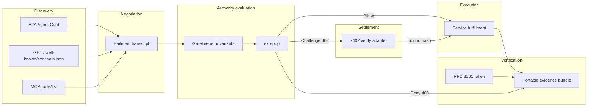
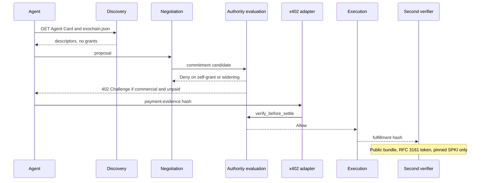

<!--
Copyright 2026 Exochain Foundation

Licensed under the Apache License, Version 2.0 (the "License");
you may not use this file except in compliance with the License.
You may obtain a copy of the License at:

    https://www.apache.org/licenses/LICENSE-2.0

Unless required by applicable law or agreed to in writing, software
distributed under the License is distributed on an "AS IS" BASIS,
WITHOUT WARRANTIES OR CONDITIONS OF ANY KIND, either express or implied.
See the License for the specific language governing permissions and
limitations under the License.

SPDX-License-Identifier: Apache-2.0
-->

# v0.3.1 proposed architecture

**Status: PROPOSAL. Pending constitutional authorization. Not approved. Not a release. This document does not claim release readiness.**

This is the architecture humans will review. It is not an approved design.
ADR-001 keeps EXOCHAIN Specification v2.2 normative. Where this note adds
detail, that detail is tier-4 engineering guidance for a later implementation.

## Separation rule

Six layers. A layer may emit a typed artifact. The next layer may consume that
artifact. No layer may reach around the sequence.

| Layer | May do | Must not do |
| --- | --- | --- |
| Discovery | Publish signed descriptors, HTTP routes, SDK names, MCP tool metadata, an A2A Agent Card | Grant permission, open a bailment, charge, execute, or stamp a claim |
| Negotiation | Exchange proposal, counteroffer, commitment, fulfillment, discharge, and dispute messages | Widen a permission set, call the facilitator, or write the evidence bundle |
| Authority evaluation | Run gatekeeper invariants, authority-chain narrowing, consent, AVC validation, and the PDP | Move money, trust a discovery card as a mandate, or let the acting agent be the grantor |
| Execution | Perform the allowed service and emit a fulfillment hash | Start before Allow, mutate the mandate, or settle |
| Settlement | Map the PDP decision through the existing x402 adapter and bind a payment-evidence hash | Invent a second decision, treat a header as payment, or take a platform fee |
| Verification | Assemble and check the portable bundle, including the RFC 3161 token | Confer coverage, reopen authority, or require a private EXOCHAIN or Azure credential |

Deny is terminal for that attempt. Challenge returns to settlement and then
re-enters authority evaluation with a bound hash. It does not skip the PDP.

## Exists versus new

| Capability | Canonical home today | Proposal |
| --- | --- | --- |
| C1 MCP discovery | `crates/exo-gateway/src/rest.rs` `ExochainDiscoveryResponse`; `crates/exo-node/src/mcp/handler.rs` advertises protocol `2024-11-05` and serves `tools/list`. MCP public transport is `false` | Extend the discovery document with commercial-service pointers. Add an A2A card. Do not turn MCP calls into kernel adjudication (VCG-004) |
| C1 HTTP and SDKs | Gateway REST, `packages/exochain-sdk` (`PROTOCOL_VERSION` `0.2.7`), `packages/exochain-py`, LYNK `packages/exochain-llm-proxy` | SDK methods that fetch the card and post the existing HTTP APIs. LYNK stays the receipted LLM proxy. It is not the market protocol |
| C2 Identity | `exo-identity` DIDs; node 0dentity under unaudited feature flags | Principal and agent DIDs plus signatures. 0dentity device and behavior axes stay default-off |
| C2 Delegation | `exo-authority`: scope narrows, widening is `AuthorityError` | Market mandates are authority links. Negotiation cannot append a wider link |
| C2 Consent | `exo-consent` bailment and consent gate | Active bailment required before execution, enforced by `ConsentRequired` |
| C2 Revocation | `exo-authority` revocation, `exo-consent` termination, `exo-avc` revocation, `exo-pdp` `RevocationSet` | One revocation check inside authority evaluation, fail closed if any set says revoked |
| C2 Policy | `exo-pdp::PolicyDecisionPoint::decide` and `verify_before_settle` | The only Allow / Deny / Challenge producer |
| C2 No self-grant | `exo-gatekeeper` `check_no_self_grant` when `ctx.is_self_grant` | Market ingress must set that flag when `actor == grantor` or when the requested permission set is not a subset of the pre-image set. The flag is an input the caller can forget, so the market ingress computes it. It does not trust the agent to pass `false` |
| C3 Bilateral bailment | `exo-consent::bailment::propose` and status enum; SDK `BailmentBuilder`; MCP `exochain` consent tools | Add counteroffer as a new proposed terms hash. Commitment activates only with both signatures and a PDP Allow for the activate action |
| C3 Multipartite | No party-set type. Economy `BailmentTerms` is one bailor plus a bailee policy and a beneficiary | New party map keyed by DID in a `BTreeMap`, each with a role and a signature. Threshold is an integer count of required signatures |
| C3 Fulfillment, discharge, dispute | Not a state machine in `exo-consent`. Economy wrappers hash terms. They do not negotiate | New states in the negotiation spec. They reference hashes. They do not replace `BailmentStatus` |
| C4 Claim stamp | `POST /api/v1/avc/claims/stamp` stamps `preimage_hash` + `hash_profile=blake3-256` + a supported `kind` with RFC 3161. It does not mint a trust receipt. Kinds today are `crosschecked.action_receipt.v2`, `crosschecked.decision.v1`, `crosschecked.claim.v1` | Reuse the hop for a new kind only after a decision. Until then, stamp `crosschecked.claim.v1` over the bundle hash. Do not add a second TSA client |
| C4 Microsoft TSA | `crates/exo-node/src/avc_rfc3161.rs` default URL `http://timestamp.acs.microsoft.com`; policy OID `1.3.6.1.4.1.601.10.3.1`; DID `did:exo:microsoft-public-rsa-tsa` | Keep that profile for the minimum demonstration. Fallback is another RFC 3161 URL plus its own pinned SPKI, recorded in the bundle. See the timestamp spec |
| C5 x402 | `exo-pdp::x402`. `never_moves_money = true`. Never-paywalled: `/api/v1/avc/validate`, `/api/v1/0dentity/`, agent consent paths | Market routes call `verify`. They do not reimplement `map_decision_to_http` |
| C6 Evidence | PDP `EvidencePack` (`EVIDENCE_PACK_SPEC`), legal `EvidenceBundle`, AVC receipt `payment_evidence_hash` | New manifest `exo.market.evidence_bundle.v1` whose body is references and hashes. Not returned by AVC validate |
| C7 Assurance | `AssuranceClass` on economy pricing inputs | New adapter interface schema. `coverage_claim` is the constant `none` |
| C8 AI-SDLC | Invariants plus the two release environments | Tiered human approval. Agents are absent from every approver set |

## Authority evaluation, in order

The order is the control. Skipping a step is a defect.

1. Resolve principal DID and agent DID. Verify both signatures over the exact
   canonical bytes of the request. Unknown keys fail closed.
2. Load the authority chain. Reject empty chains, expired links, and any link
   whose scope is not a subset of its parent (`exo-authority`).
3. Compute `is_self_grant`. True if the acting DID equals the grantor DID on
   any new link, or if the requested permission set is not a subset of the
   intersection of the chain scope, the AVC scope, and the bailment permitted
   actions. True forces `NoSelfGrant` and stops the pipeline.
4. Require `human_override_preserved`. A market action that clears it fails
   `HumanOverride`.
5. Require an active, unexpired, unrevoked bailment that covers the action
   (`ConsentRequired`). Proposed or countered bailments do not authorize
   execution.
6. Validate the AVC. Revoked, expired, or out-of-scope credentials deny.
   `delegation_allowed` on the credential is honored. An agent with
   `delegation_allowed = false` cannot mint a child credential inside
   negotiation.
7. Call `PolicyDecisionPoint::verify_before_settle`. This is the only place
   that emits Allow, Deny, or Challenge.
8. Map through `map_decision_to_http`. Deny is 403 and outranks a bound hash.
   Challenge is 402. Allow with a bound non-zero payment-evidence hash is 200
   for a commercial mandate. Allow without that hash on a commercial mandate
   stays 402.

## What each layer stores

Hashed bytes are canonical CBOR with a domain string. JSON Schemas in
`schemas/` are the interchange proposal for third parties. They are not a
second hash preimage. If JSON and CBOR disagree, CBOR wins for any hash this
design defines, and the interchange file must carry the CBOR hash it claims.

Timestamps inside governance logic are HLC values supplied by the caller.
The RFC 3161 token carries the TSA's generalized time. That time is evidence
of when the TSA signed. It is not an EXOCHAIN clock and it is not read from
`SystemTime` inside protocol logic.

Collections that are hashed are sorted. Party sets are `BTreeMap` keyed by
DID. No unordered map crosses a hash boundary.

## Default-off

No route, MCP tool, or SDK method described as new in this document exists
yet. When implementation is authorized, those entry points ship behind an
unaudited feature that CI's feature matrix must list, default off, fail
closed when the feature or its configuration is absent, and unable to mint
consent, authority, or coverage. Turning the feature on is a separate
decision from authorizing this proposal.

## Interoperability boundary

A third party needs only:

- the Agent Card and `/.well-known/exochain.json`;
- the HTTP APIs named on that card;
- the JSON Schemas and test vectors in this package;
- the public signature algorithms already used by EXOCHAIN (Ed25519 for
  EXOCHAIN signatures, RSA as carried inside the RFC 3161 CMS token);
- pinned SPKI bytes published inside the bundle.

A third party does not need the workspace, a database, a bearer token, or an
Azure subscription. That constraint is AC-8 and AC-9 in [GOAL.md](GOAL.md).

## Relationship to adjacent products

LegalDyne, LiveSafe, CrossChecked, CyberMedica, CommandBase, and the LYNK
public site are outside this architecture. LYNK's receipted proxy may later
be a commercial service that *uses* this path. It is not this path. This
package does not change those surfaces and does not let them claim
constitutional enforcement by proximity.
