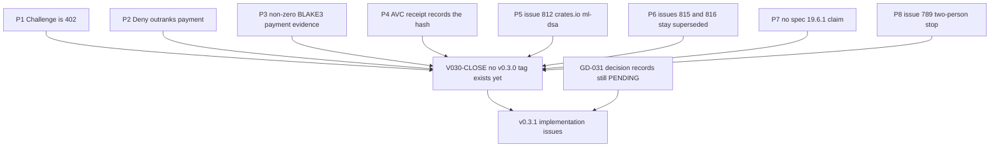
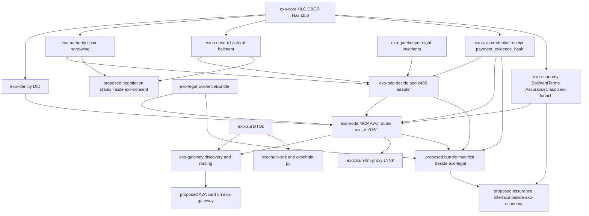
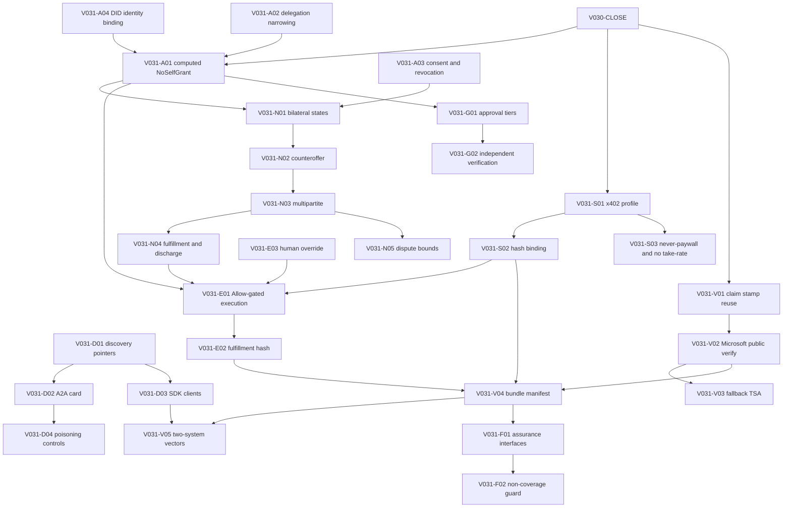

<!--
Copyright 2026 Exochain Foundation

Licensed under the Apache License, Version 2.0 (the "License");
you may not use this file except in compliance with the License.
You may obtain a copy of the License at:

    https://www.apache.org/licenses/LICENSE-2.0

Unless required by applicable law or agreed to in writing, software
distributed under the License is distributed on an "AS IS" BASIS,
WITHOUT WARRANTIES OR CONDITIONS OF ANY KIND, either express or implied.
See the License for the specific language governing permissions and
limitations under the License.

SPDX-License-Identifier: Apache-2.0
-->

# v0.3.1 dependency graph

**Status: PROPOSAL. Pending constitutional authorization. Not approved. Not a release. This document does not claim release readiness.**

Arrows mean "cannot be implemented honestly until". They are not an
authorization to implement.

## v0.3.0 blocks v0.3.1

`main` already contains the 0.2.4 cut of P1–P4. The node `V030-CLOSE` is still
open because [v0.3.0/GOAL.md](../v0.3.0/GOAL.md) says that cut is not a v0.3.0
close, and because this checkout has no `v0.3.0` tag. Issue #813 remains the
evidence-grade train named by the 0.2.4 RC and the 0.2.6 issue disposition.

## Crate and module graph

Existing crates are solid. Proposed modules are dashed in the labels. No new
crate is requested. A new crate would be a parallel implementation.

Module-level reuse inside the crates:

| Proposed behavior | Call this | Do not create |
| --- | --- | --- |
| Allow / Deny / Challenge | `PolicyDecisionPoint::verify_before_settle` | A market PDP |
| HTTP 402 / 403 / 200 | `exo_pdp::x402::map_decision_to_http` | A market status map |
| Payment hash | `PAYMENT_EVIDENCE_DOMAIN` and non-zero `Hash256` | A second domain |
| Receipt of that hash | `AvcTrustReceipt.payment_evidence_hash` | A parallel receipt type |
| Timestamp | `avc_rfc3161` and `POST /api/v1/avc/claims/stamp` | A new TSA crate |
| Scope check | `AuthorityChain` verification | A market permission algebra |
| Self-grant | `check_no_self_grant` with a computed flag | An agent-signed waiver |
| Bilateral propose | `exo_consent::bailment::propose` | A second `Bailment` struct |
| Pricing classifier | `AssuranceClass` | A coverage enum |
| Discovery document | `ExochainDiscoveryResponse` | A second well-known identity document that omits the existing routes |
| LLM commercial calls | LYNK receipt path | A market protocol inside the proxy |

## Work-item order

Issue identifiers are local to [ISSUES.md](ISSUES.md). They are not GitHub
issue numbers.

G01 and G02 govern how any of the other items may be written. They do not
unblock `V030-CLOSE`. An agent may draft an issue's tests after authorization.
An agent cannot approve the decision records and cannot be either release
approver.
