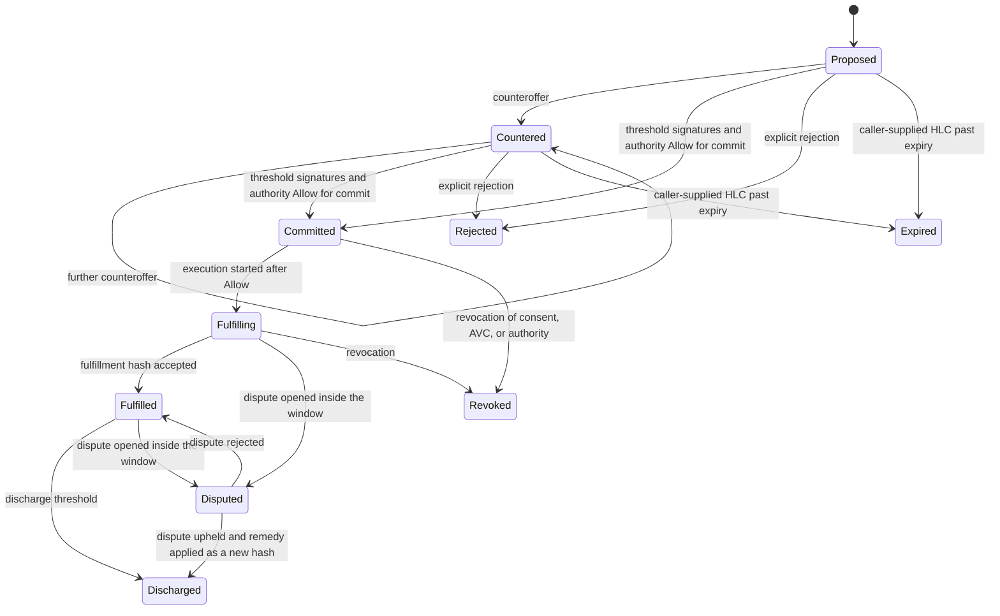

<!--
Copyright 2026 Exochain Foundation

Licensed under the Apache License, Version 2.0 (the "License");
you may not use this file except in compliance with the License.
You may obtain a copy of the License at:

    https://www.apache.org/licenses/LICENSE-2.0

Unless required by applicable law or agreed to in writing, software
distributed under the License is distributed on an "AS IS" BASIS,
WITHOUT WARRANTIES OR CONDITIONS OF ANY KIND, either express or implied.
See the License for the specific language governing permissions and
limitations under the License.

SPDX-License-Identifier: Apache-2.0
-->

# Bailment negotiation protocol

**Status: PROPOSAL. Pending constitutional authorization. Not approved. Not a release. This document does not claim release readiness.**

Capability C3. Layer: negotiation. Authority consequences are decided only by
the authority-evaluation layer.

## What already exists

`exo-consent` `Bailment` is bilateral. `propose` builds a record in
`Proposed`. Status values are `Proposed`, `Active`, `Suspended`,
`Terminated`, and `Expired`. Types include `Custody`, `Processing`,
`Delegation`, `Licensure`, and `Emergency`. Terms are hashed under
`exo.bailment.terms.v1`. The SDK `BailmentBuilder` and the MCP consent tools
call this shape.

`exo-economy` `BailmentTerms` is a transactional wrapper for contribution
adoption, hashed under `exo.economy.bailment_terms.v1`. It names a bailor, a
bailee policy hash, a beneficiary, dispute and revocation policy ids, and
`human_approval_required_for`. It is not a negotiation transcript.

This protocol extends the consent bailment. It does not create a third
bailment type family. Economy terms may be referenced by hash when the
relationship is a contribution adoption. They are not required for a
commercial service bailment.

## Parties

A negotiation has a party set. Bilateral is the set of size two: one
`bailor` and one `bailee`. Multipartite is a set of three or more.

Each party entry:

| Field | Rule |
| --- | --- |
| `did` | `did:exo:` principal or agent |
| `role` | `bailor`, `bailee`, `beneficiary`, `service`, `witness` |
| `signing_key_id` | Key already bound to the DID |
| `agent_for` | Empty for a principal. For an agent, the principal DID |

Keys are sorted by DID. The hashed encoding is a CBOR map, which `ciborium`
emits in sorted key order. An implementation that iterates a party set uses
`BTreeMap`.

An agent party is present only when its AVC and authority chain already name
that principal and that role. Adding oneself as a party with a new permission
is a self-grant and is rejected in authority evaluation before the transcript
advances.

## States



`Committed` activates the underlying `exo-consent` bailment (`Active`) only
after authority evaluation returns Allow for the activate action. A signature
quorum is necessary and not sufficient.

`Discharged` is terminal for obligations named in the terms hash. It does not
delete the transcript. `Revoked` stops fulfillment. It does not rewrite prior
signatures.

There is no state that grants a permission. The permission ceiling is copied
by hash from the mandate at proposal time. Later messages may drop
permissions. They may not add them. The check is subset, computed by
authority evaluation, not asserted by the message.

## Messages

Every message carries:

- `transcript_id` (non-empty, caller-supplied);
- `prev_hash` (BLAKE3 of the previous canonical message, or 32 zero bytes
  only for the first proposal);
- `terms_hash` (BLAKE3 of canonical terms CBOR under
  `exo.market.bailment.terms.v1`);
- `parent_consent_terms_hash` when the message also binds an
  `exo-consent` terms hash;
- `hlc` (non-zero caller-supplied timestamp);
- `actor_did`;
- `signature` over the canonical message bytes, domain
  `exo.market.bailment.message.v1`.

Message kinds: `proposal`, `counteroffer`, `commit`, `fulfillment`,
`discharge`, `dispute`, `reject`, `revoke`.

### Proposal

Opens `Proposed`. Names the party set, the service hash being bought or
performed, integer `amount_minor`, a currency code string, and the permission
ceiling as a sorted list of permission names copied from the current mandate.
The ceiling is a snapshot. It is not a grant.

### Counteroffer

Replaces `terms_hash`. The new permission list must be a subset of the
proposal ceiling. Price may change. Price is not a permission. A counteroffer
that adds a party requires that party's already-authorized role. An agent
cannot add a party whose authority it does not already hold, and it cannot
hold that authority by adding it.

### Commitment

`Committed` requires:

- signatures from at least `threshold` distinct party DIDs;
- `threshold` is an integer, at least 2, at most the party count;
- every required `bailor` and `bailee` has signed the current `terms_hash`;
- authority evaluation Allow for the commit action;
- no revocation in any of consent, AVC, authority chain, or PDP revocation
  set at the caller-supplied `now`.

### Fulfillment

Emitted by execution, not by negotiation acting alone. It records the
fulfillment hash and the PDP evidence hash that Allowed the execution.
Negotiation stores the message. It does not decide Allow.

### Discharge

Signed by the threshold after fulfillment. Discharge terms may narrow
remaining obligations. They may not create a new payment obligation that
bypasses x402. A further payment is a new commercial mandate.

### Dispute

May be opened only by a party, only before discharge, only before the
caller-supplied dispute deadline in the terms. A dispute names a reason code
from a closed set: `non_delivery`, `defective_delivery`, `unauthorized_act`,
`amount_mismatch`. Free-text evidence is hashed, not stored as authority.

Griefing bounds, which authority evaluation enforces:

- one open dispute per transcript;
- a party may file at most `max_disputes` disputes across the transcript,
  integer, default 1 in the minimum demonstration;
- a rejected dispute does not reset the deadline;
- filing a dispute does not freeze unrelated transcripts and does not expand
  the filer's permissions;
- human override remains available. A dispute cannot clear
  `human_override_preserved`.

An upheld dispute records a remedy hash. The remedy is a new terms hash that
is still a subset of the original ceiling. It is not damages computed in
floating point and it is not a self-issued credit.

## Multipartite rule

For three or more parties the commitment threshold is an explicit integer in
the terms. Default for the minimum demonstration is "all bailors and all
bailees," which is still an integer equal to that count. Witnesses do not
count toward the threshold unless the terms list them as required.

Collusion is not prevented by the threshold. The threshold proves who signed.
Verification records the set. It does not claim the parties were independent.
Independence, where a quorum is involved, stays with `exo-governance` quorum
rules and is not reinvented here. A market commitment is not a governance
quorum.

## Canonical hash

```text
domain = "exo.market.bailment.terms.v1"
hash = BLAKE3(canonical_cbor(domain, terms))
```

Terms include the sorted party list, permission ceiling, integer amount,
currency, deadline HLCs, threshold, and the service descriptor hash. They
exclude signatures. Signatures cover the hash plus the message kind.

## HTTP sketch

Proposed, default-off:

| Method | Path | Effect |
| --- | --- | --- |
| POST | `/api/v1/market/bailments` | Submit a proposal message |
| POST | `/api/v1/market/bailments/:id/messages` | Append a counteroffer, commit, dispute, reject, or discharge message |
| GET | `/api/v1/market/bailments/:id` | Read the transcript |

GET is not authority. POST runs authority evaluation for any message that
changes status toward `Committed`, `Fulfilling`, or `Discharged`. A failed
check appends nothing.

`POST /api/v1/avc/validate` is not this API.
